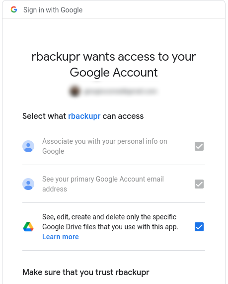

<!-- README.md is generated from README.Rmd. Please edit that file -->

# rbackupr

<!-- badges: start -->

[](https://lifecycle.r-lib.org/articles/stages.html#experimental)
<!-- badges: end -->

The goal of rbackupr is to facilitate online backups to from R. At the
current stage, it facilitates backups only to Google Drive, but may
support other services in the future.

**Warning: This package is being overhauled and it is not functional at
this stage**

## Core motivation

By default, when you use the `googledrive` package you give access to
all of your Google Drive. This has a number of shortcomings, in
particular if you use Google Drive for different reasons and you have
many files and folders stored there:

-   going thrhough a lot of files, `googledrive` is slow in finding what
    you need
-   in particular if you use `googledrive` from a remote server, you may
    feel unconfortable in potentially leaving an open door to *all* of
    the files you have stored there
-   even if you use it locally, you may be concerned of the mistakes you
    could make by giving full access to all of your files to scripts
    written by you, or to packages published by a random GitHub user
    (such as the author of this package)

While you can give full access to Google Drive if you so wish,
`rbackupr` is developed based on the expectation that it will have only
access to the [“drive.file” scope of Google
Drive](https://developers.google.com/drive/api/v2/about-auth), i.e. that
it have “access to files created or opened by the app”. In brief, of
course you still need to trust the scripts you are running, but at least
you can be sure that it will not mess with completely unrelated files
you keep on Google Drive.

See screenshot of Google authentication prompt, where it is clear that
you give `rbackupr` access only to “the specific Google Drive files that
you use with this app.”



In order to reduce the impact of some of the issues that come with this
choice, this app caches locally metadata about remote folders and files
in order to speed up processing.

An additional benefit of `rbackupr` is that it is agnostic about the
location of the base folder, as it stores only relative path: it is
possible to keep a folder up to date from different locations, or move a
folder and have it updated without issues.

## Installation

You can install the development version of `rbackupr` from
[GitHub](https://github.com/) with:

``` r
# install.packages("remotes")
remotes::install_github("giocomai/rbackupr")
```

## How to use

In order to show how this package works, we will first create some files
with random data in the temporary folder. So this is how our base folder
looks like: a main folder, with some sub-folders, and some files within
each of them.

``` r
library("rbackupr")
base_temp_folder <- fs::dir_create(fs::path(tempdir(),
                                            "rbackupr_testing"))

subfolder_names <- stringr::str_c("data_",
                                  sample(x = 10:100, size = 3, replace = FALSE))

purrr::walk(
  .x = subfolder_names,
  .f = function(x) {
    current_folder <- fs::path(base_temp_folder, x)
    fs::dir_create(path = current_folder)
    current_number <- stringr::str_extract(string = x, pattern = "[[:digit:]]+") %>% 
      as.numeric()
    
    purrr::walk(
      .x = rep(NA, sample(x = 2:5, size = 1)),
      .f = function(x){
        readr::write_csv(x = tibble::tibble(numbers = rnorm(n = 10, mean = current_number)), 
                         file = fs::file_temp(pattern = stringr::str_c("spreadsheet_", current_number, "_"),
                                              tmp_dir = current_folder,
                                              ext = "csv"))
      })
  })


fs::dir_tree(base_temp_folder)
#> /tmp/RtmpwuEIZx/rbackupr_testing
#> ├── data_34
#> │   ├── spreadsheet_34_5ce139b92a2e.csv
#> │   └── spreadsheet_34_5ce154f88473.csv
#> ├── data_58
#> │   ├── spreadsheet_58_5ce126b0f0c8.csv
#> │   ├── spreadsheet_58_5ce139e68a68.csv
#> │   └── spreadsheet_58_5ce15667f03c.csv
#> └── data_74
#>     ├── spreadsheet_74_5ce113d8bb6e.csv
#>     ├── spreadsheet_74_5ce12a89c112.csv
#>     └── spreadsheet_74_5ce15e6f6737.csv
```

By default, `rbackupr` does not cache metadata files and folders it
stores on Google Drive, but you are strongly encouraged to do so. You
can do so with `rb_enable_cache()`. By default, metadata will be cached
in the current active directory, but if you use `rbackupr` with
different projects, you may not want to leave files with cached metadata
scattered around your local drive, but rather keep them in place where
they can be accessed. Something like this could typically be included at
the beginning of `rbackupr` backup scripts.

``` r
library("rbackupr")
rb_enable_cache()

rb_set_cache_folder(path = fs::path(fs::path_home_r(),
                                    "R",
                                    "rb_data"))

rb_create_cache_folder(ask = FALSE)
```

To reduce mixing of files you uploaded with `rbackupr` with other files
you likely have on Google Drive, all your files and folders are stored
under a base folder, that by default is called “rbackupr”. You can call
your base folder something else, you can have more than one base folder,
but you’re probably fine just by keeping the defaults. Under your base
folder, you will have a “project” folder, and under that folder, you
will actually have all your files related to that project.

No matter full path on your files on your hard drive, the folder you set
up to backup will correspond to the project folder.

So the first step you need to take, is set a project for the current
session, and then actually create its own folder on Google Drive, if it
doesn’t yet exist.

``` r
rb_set_project(project = "rbackupr_testing") # this will set the project for the current session

rb_drive_create_project(create = TRUE) # if it already exists, it just returns its dribble
```

At this stage, among all your files and folder on Google Drive, you
should expect to find a folder called `rbackupr` by default (you can
customise this in `rb_drive_create_project()`). Within that folder, you
will find another folder, `rbackupr_testing` (the one we set as
project). All the files you backup from now on in the current session
will be located under this folder.

Notice that since we are giving only the `drive.file` scope, i.e. only
access to files and folders created with the current app, if you run
`googledrive::drive_ls()` you should only see those two folders and
nothing else.

The following steps are based on the basic idea of caching locally key
information about online resources stored by Google Drive This is
helpful in particular considering the fact that if you have many files,
retrieving just a full file list from Google Drive to check what needs
to be uploaded can be extremely time-consuming. In the local cache, for
simplicity, not all data that are part of a dribble are stored.

For the base folder, under which all projects are expected to be
located, only name and dribble id are stored. Indeed, they have no
“parent folder”.

``` r
rb_drive_find_base_folder()
#> # A tibble: 1 × 2
#>   name     id                               
#>   <chr>    <drv_id>                         
#> 1 rbackupr 1DFtFrmrV1_szp3NrbuWkq45FzozFwzOy
```

Even if all projects are expected to be located under a single base
folder, local cache for them stores also the id of the base folder as
`parent_id`.

``` r
rb_get_project()
#> # A tibble: 1 × 3
#>   name             id                                parent_id                  
#>   <chr>            <drv_id>                          <chr>                      
#> 1 rbackupr_testing 1qDwq0vp7MBRdzDjco6cEg6VVlZZ3G0VH 1DFtFrmrV1_szp3NrbuWkq45Fz…
```

Under the project folder, the real folders and files that are part of
the backup are stored.

We can see the folders included in the base project with:

``` r
rb_get_project() %>% 
  rb_get_folders()
#> # A tibble: 0 × 4
#> # … with 4 variables: name <chr>, id <drv_id>, parent_id <drv_id>,
#> #   relative_path <fs::path>
```

Then, for files, more details are stored in cache, including:

``` r
rb_get_project() %>% 
  rb_get_folders() %>% 
  dplyr::slice(1) %>% 
  rb_get_files()
#> # A tibble: 0 × 11
#> # … with 11 variables: name <chr>, id <drv_id>, mimeType <chr>,
#> #   createdTime <chr>, modifiedTime <chr>, originalFilename <chr>,
#> #   fullFileExtension <chr>, size <chr>, md5Checksum <chr>, parent_id <drv_id>,
#> #   rbackupr_cache_time <dttm>
```

## Creating your own app

For more details on creating your own app see in particular:

-   [How to get your own API
    credentials](https://gargle.r-lib.org/articles/get-api-credentials.html)
-   [Bring your own OAuth app or API
    key](https://googledrive.tidyverse.org/articles/bring-your-own-app.html)

Creating your own app has many benefits; most importantly:

-   you’re in control (well, Google is ultimately always in control, but
    at least it’s just you and them)
-   you don’t risk hitting the rate limiting because some other user is
    busy with the same app

Ultimately, `rbackupr` relies on `gargle` for the authentication, so you
can still follow the relevant documentation to set some settings.

``` r
# See ?gargle_oauth_cache()

options(
  gargle_oauth_email = "jane@example.com",
  gargle_oauth_cache = "/path/to/folder/that/does/not/sync/to/cloud"
)
```

## Database cache structure

The local SQLite database created for caching has the following
structure:

-   a table with details about the “base_folder”
    (“rbackupr_base_folder”). This may well have a single row in many
    common use cases.
-   a table with details about the project folders
    (“rbackupr_projects”). This will have one row per project created.
-   one table for folders and one for files under each project. They
    will be called “rbackupr_folders_ProjectName” and
    “rbackupr_files_ProjectName”, where “ProjectName” is the name of the
    project, typically set with `rb_set_project()`.

## Things to keep in mind

Once authenticated, you can still use `googledrive`. Keep in mind that
some things may not work as expected, due to the restricted access to
Google Drive given by this app.

For example, listing all files with `googledrive::drive_ls()` will only
list files created with this app.
